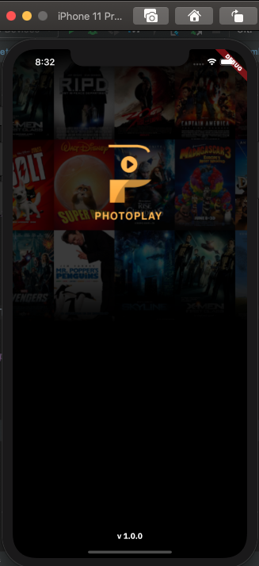
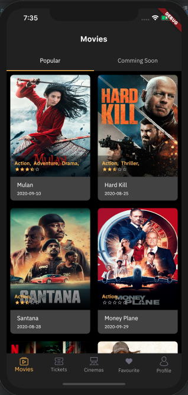
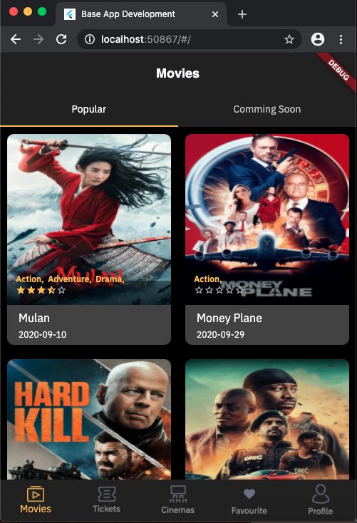
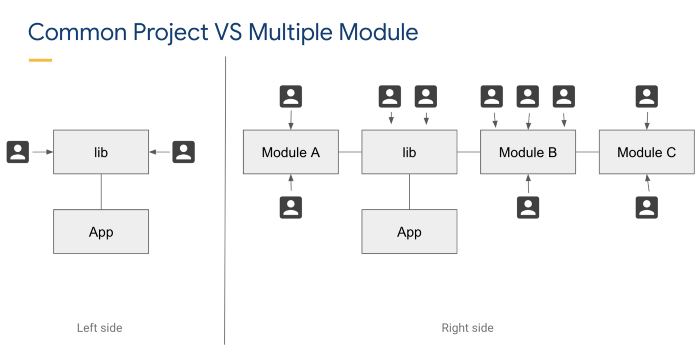

# flutter_base_project

## 📸 Example iOS
<pre>
     
</pre>

## 📸 Example android
<pre>

</pre>

## 📸 Example web
<pre>

</pre>

## 📸 Example desktop
<pre>

</pre>


## Modularization Structure 🔥

    # Root Project
    .
    ├── core                   # Name of module (new package)
    │   ├── bloc               # State management Business logic component.
    │   ├── cubit              # State management
    │   └── network            # Remote Data Handlers
    |       ├── api            # Retrofit API for remote end point, model using Equatable.
    |       ├── model          # Model / POJO using Equatable.
    │       └── repository     # Single source of data and for handling data from network to cache.
    |
    ├── lib                    # Name of module (default from Flutter)
    │   └── ui                 # Activity/View layer
    |
    └── shared                 # Name of module (new package)
        ├── common             # Common shared.
        │   ├── helpers        # Custom function, extension, etc which can be used repeatedly on each method.
        │   ├── styles         # Custom style that will be used on each widget.
        │   └── utils          # Utility classes.
        └── widget             # Custom widget which can be used repeatedly.


## Why should be Modular?


For example, on the left, we can only split the work for two or more developers. But on the right hand side, we can divide the work between five or more developers, and this is also very suitable for large teams because we are dividing the project as modules. So that developers can focus on their respective modules.

## Built With 🛠
* [BLoC Pattern](https://bloclibrary.dev/) - Business logic component to separate the business logic with UI.
* [Koin](https://github.com/pbissonho/koin.dart) - dependency injection.
* [Equatable](https://pub.dev/packages/equatable) - Being able to compare objects in `Dart` often involves having to override the `==` operator.
* [Dio](https://github.com/flutterchina/dio/) - A type-safe HTTP client.
* [Alice](https://github.com/jhomlala/alice/) - Alice is an HTTP Inspector tool for Flutter which helps debugging http requests.
* [Json Serializable](https://pub.dev/packages/json_serializable) - Builders for handling JSON.
* [Shared Preferences](https://pub.dev/packages/shared_preferences) - Cache implementation approach.
* [Modularization](https://medium.com/flutter-community/mastering-flutter-modularization-in-several-ways-f5bced19101a) - Separate functionality into independent, interchangeable modules.
* [Shimmer](https://pub.dev/packages/shimmer) - Loading handler.
* [Lottie](https://github.com/xvrh/lottie-flutter) - Lottie is a parses Adobe After Effects animations exported as json with Bodymovin and renders them natively on mobile!
* [Flutter Launcher Icons](https://pub.dev/packages/flutter_launcher_icons) - Launcher icons handler.
* [Integration Testing](https://flutter.dev/docs/cookbook/testing/integration/introduction) - Automating UI/Integration Tests.
* [Flavor](https://medium.com/@animeshjain/build-flavors-in-flutter-android-and-ios-with-different-firebase-projects-per-flavor-27c5c5dac10b) - Handling different environments for development and production.
* State - (Loading, No Data, Has Data, No Internet Connection, Request Timeout, Error)

## Todo list
* [ ] Implementation koin dependency injection.
* [ ] Implementation Pull To Refresh
* [ ] Implementation Load More
* [X] Implementation Notification (Firebase and one signal)
* [ ] Implementation Deeplink
* [ ] Implementation Google analitycs
* [ ] Implementation Facebook pixel
* [ ] Implementation Login Social Media
* [ ] Implementation Fastlane
* [ ] Implementation Unit Testing

If you want to create a `* .g.dart` file, you can use this command in the terminal. But before you run it, make sure you enter the [core] module, using the `cd` command. For example `cd core`. Then you can run the below command.

### Run Flutter app between Flavor for development and production with command prompt

Development
```console
flutter run --flavor development --target=lib/ui/launcher/main-dev.dart
```
Production
```console
flutter run --flavor production --target=lib/ui/launcher/main-prod.dart
```

One time build:
```console
flutter pub run build_runner build
```
or you can watch for changes and rebuild automatically
```console
flutter pub run build_runner watch
```

run package flutter_launcher_icon
```console
flutter pub run flutter_launcher_icons:main
```

Firebase messaging to topic
```console
{
	"to": "/topics/your_topic",
	"notification": {
          "message": "body movie 1",
          "title": "title movie 1"
       },
       "priority": "high",
       "data": {
           "body": "body movie",
           "title": "title movie",
           "id": 10,
           "click_action": "FLUTTER_NOTIFICATION_CLICK",
           "sound": "default",
           "status": "done",
           "screen": "/detailMovieScreen",
           "extradata": ""
       }
}
```
## Author

* **Aldy Ramadhan**